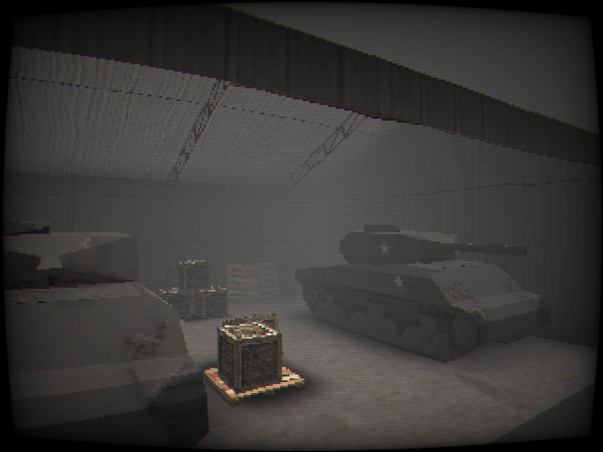
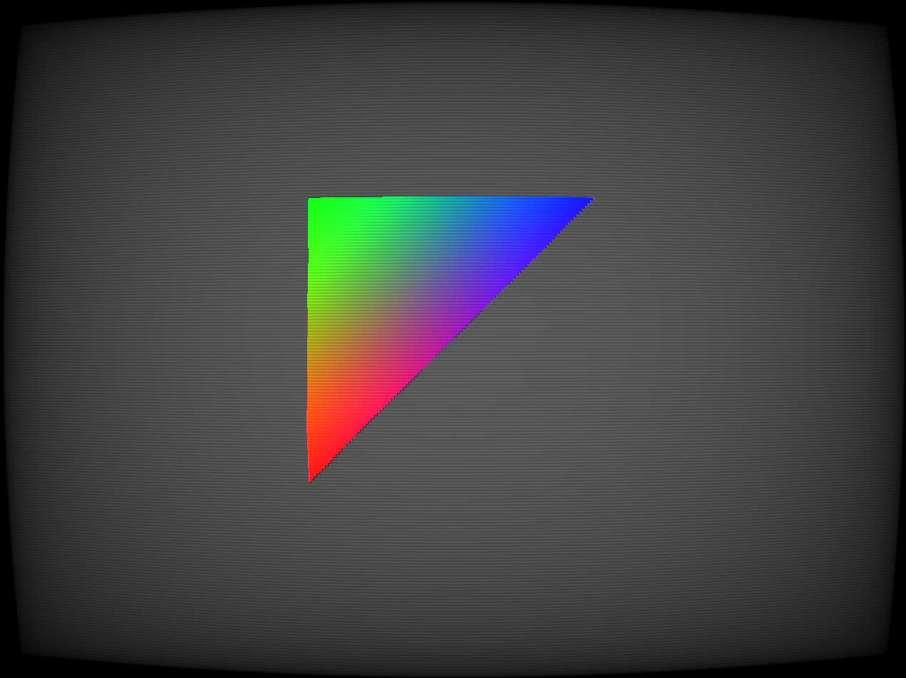

# Polybox

Polybox is an in-development PS1 era fantasy console, a bit like Pico-8, but with simple 3D as well as 2D.



It's still rather primitive and early in development, mostly it's just a dedicated PS1 renderer right now with an old fashioned fix function pipeline. You render objects like this:

```lua
function Update(deltaTime)
    MatrixMode("Projection")
    Identity()
    Perspective(320, 240, 1, 20, 60)

    MatrixMode("View")
    Identity()
    Translate(-1.5, -1.5, -2)

    BeginObject3D("Triangles")
        Color(1.0, 0.0, 0.0, 1.0)
        Vertex(1.0, 1.0, 0.0)

        Color(0, 1, 0, 1)
        Vertex(1, 2, 0)

        Color(0, 0, 1, 1)
        Vertex(2.0, 2.0, 0.0)
    EndObject3D()
end
```

The above gives you the following output:



# Current features

- PS1 era fixed-function 3D rendering
- Special shaders for emulating PS1 era look
- Basic flat and smooth shaded lighting
- Gltf model loading
- 2D sprite drawing
- Depth cueing fog
- Simple 2D shape drawing
- Lua VM for running your game code
- Input system that emulates a PS1 like controller

# Planned features

- Luau integration
    - Picotron like buffers for handling large data
- Data serialization system
- Audio System
- Developer mode and project management system (files, config etc)
- Development tools such as level editors made in the development environment
- Some sample games
- WebGPU support
- More fleshed out 2D rendering

# Supported platforms

Currently only Windows 64 bit. It shouldn't be that hard to port to other platforms though, as it uses bgfx for rendering and SDL for platform stuff. But it's early enough I have no interest in porting and testing on other platforms.

# Documentation

Also too early for this, but the codebase is extremely simple and hopefully self documenting. The main API that is of interest is the GraphicsChip.h file. The entire rendering API is contained there in a very small amount of code, so small I can list it here,

```cpp
void Init();
void DrawFrame(float w, float h);

// Basic draw 2D
void DrawSprite(const char* spritePath, float x, float y);

// Basic draw 3D
void BeginObject3D(EPrimitiveType type);
void EndObject3D();
void Vertex(Vec3f vec);
void Color(Vec4f col);
void TexCoord(Vec2f tex);
void Normal(Vec3f norm);

void SetClearColor(Vec3f color);

// Transforms
void MatrixMode(EMatrixMode mode);
void Perspective(f32 screenWidth, f32 screenHeight, f32 nearPlane, f32 farPlane, f32 fov);
void Translate(Vec3f translation);
void Rotate(Vec3f rotation);
void Scale(Vec3f scaling);
void Identity();

// Texturing
// Enable/Disable texturing
void BindTexture(const char* texturePath);
void UnbindTexture();

// Lighting
void NormalsMode(ENormalsMode mode);
void EnableLighting(bool enabled);
void Light(int id, Vec3f direction, Vec3f color);
void Ambient(Vec3f color);

// Depth Cueing
void EnableFog(bool enabled);
void SetFogStart(f32 start);
void SetFogEnd(f32 end);
void SetFogColor(Vec3f color);
```


# Compiling

The project is relatively simple to compile, all you need is cmake and the MSVC build tools, and then just run the build.bat file in the root of the repo, which will run cmake and compile the project
